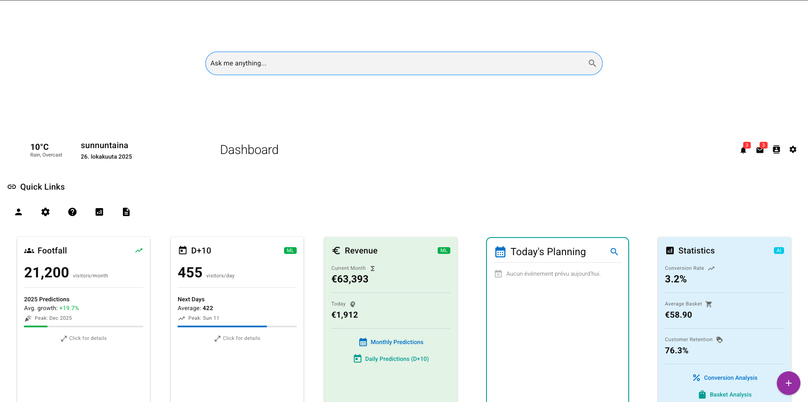
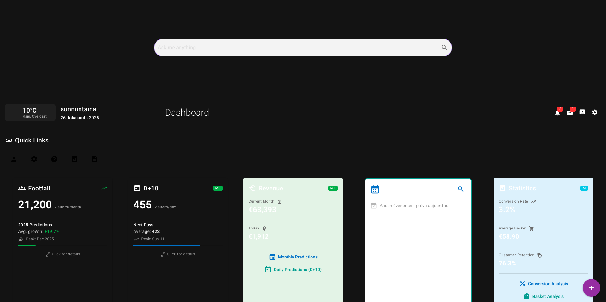
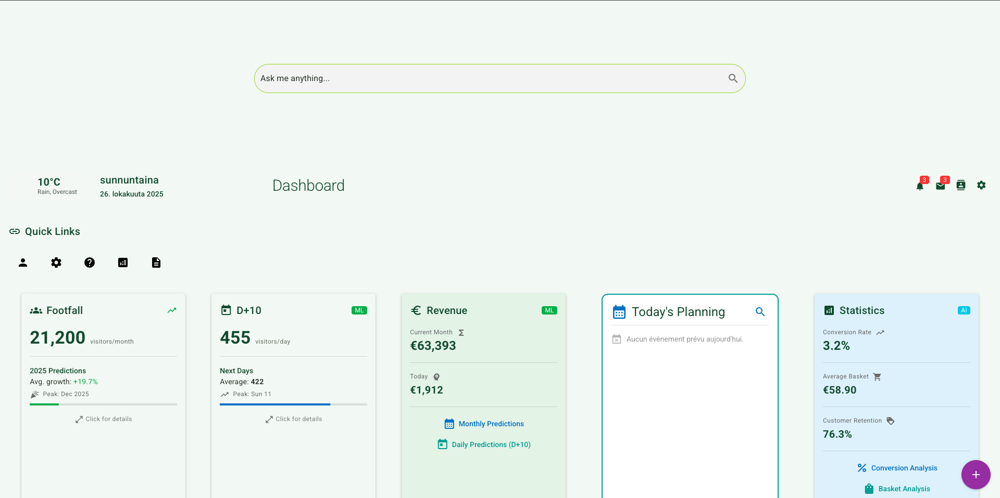
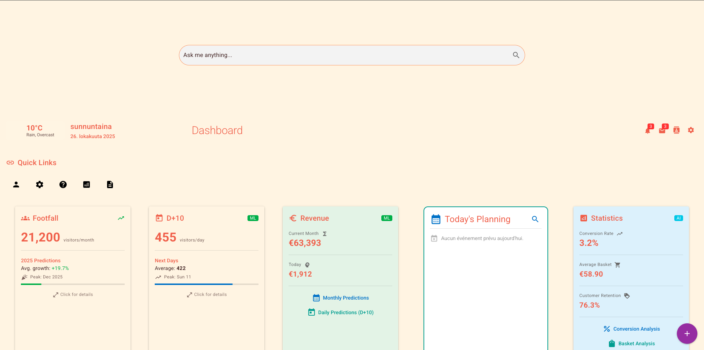
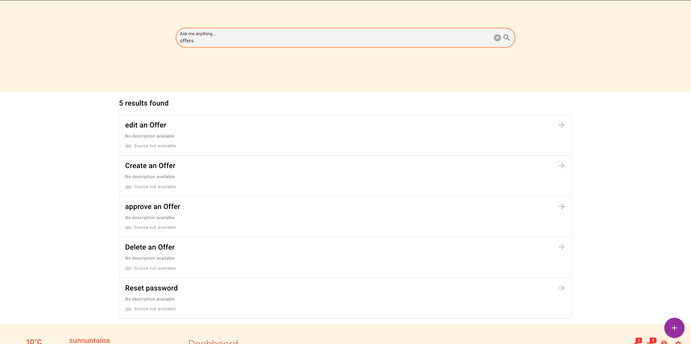
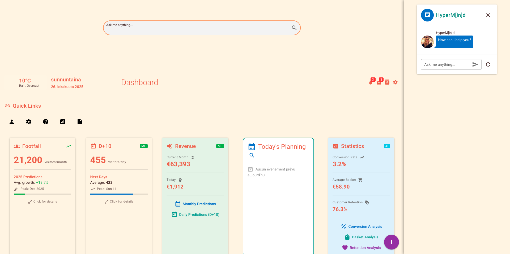
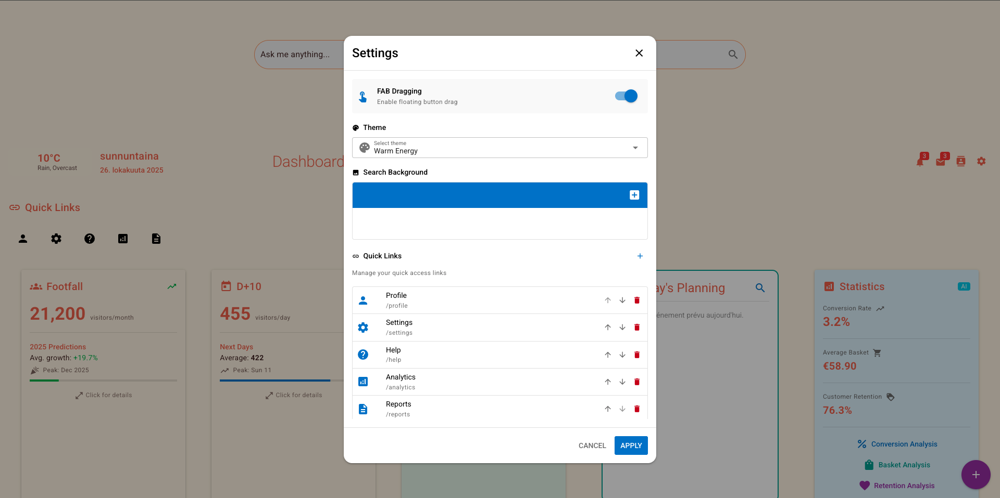
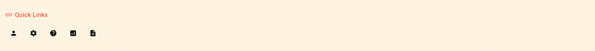
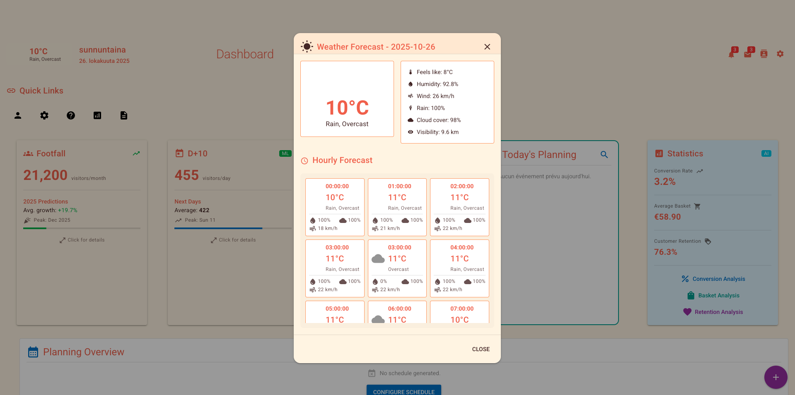
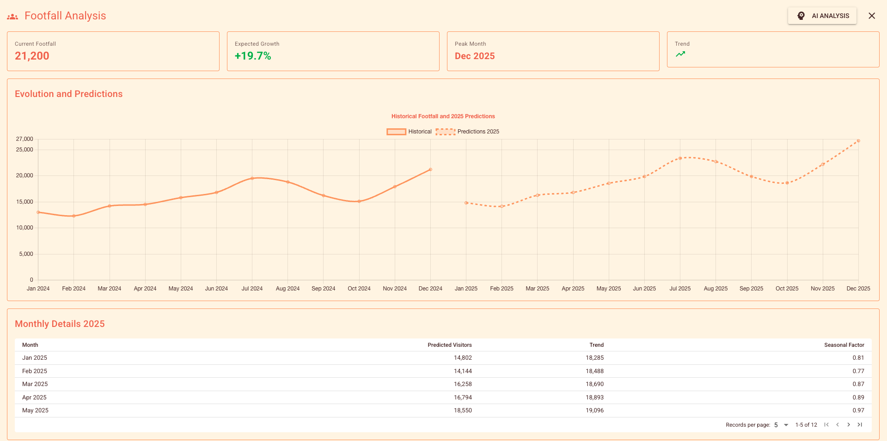

# 🏢 Tenant Dashboard - Advanced Analytics & Management System

> A comprehensive, AI-powered dashboard for tenant management with real-time analytics, ML predictions, and customizable theming.

[](https://vuejs.org/)
[](https://quasar.dev/)
[](https://www.tensorflow.org/js)
[](https://typesense.org/)

---

## 📸 Screenshots & Demos

### Dashboard Overview

*Main dashboard with tiles, weather widget, and quick links*

### Theme Variations

<table>
  <tr>
    <td width="50%">
      
      <p align="center"><b>Classic Light</b> - Professional & Clean</p>
    </td>
    <td width="50%">
      
      <p align="center"><b>Elegant Dark</b> - Modern & Sophisticated</p>
    </td>
  </tr>
  <tr>
    <td width="50%">
      
      <p align="center"><b>Gentle Nature</b> - Eco-Friendly & Calm</p>
    </td>
    <td width="50%">
      
      <p align="center"><b>Warm Energy</b> - Vibrant & Dynamic</p>
    </td>
  </tr>
</table>

### Key Features

| Feature | Screenshot |
|---------|-----------|
| **AI-Powered Search** |  |
| **Intelligent ChatBot** |  |
| **Settings & Configuration** |  |
| **Quick Access Links** |  |
| **Weather Widget** |  |
| **ML Predictions** |  |

### Interactive Demos

#### Theme Switching

*Seamless theme transitions with live preview*

#### ChatBot Interaction

*AI-powered search and help system in action*

#### Draggable FAB

*Customizable floating action button positioning*

#### Search in Action

*Real-time semantic search with Typesense*

#### Tile and Prediction

*Overview and full view of prediction*

---

## 📑 Table of Contents

- [Overview](#-overview)
- [Key Features](#-key-features)
- [AI-Powered Analytics](#-ai-powered-analytics)
- [Dashboard Tiles](#-dashboard-tiles)
- [Theme System](#-theme-system)
- [Architecture](#-architecture)
- [Getting Started](#-getting-started)
- [Configuration](#-configuration)
- [ML Predictions](#-ml-predictions)
- [Theming](#-theming)
- [Security](#-security)
- [Performance](#-performance)
- [Troubleshooting](#-troubleshooting)
- [API Documentation](#-api-documentation)
- [Contributing](#-contributing)

---

## 🎯 Overview

The Tenant Dashboard is a modern, Vue.js-based analytics platform that combines:
- **Real-time Data Visualization** - Interactive charts and metrics
- **Machine Learning Predictions** - TensorFlow.js powered forecasting
- **Semantic Search** - Typesense integration for intelligent search
- **AI ChatBot** - Context-aware help and support
- **Multi-Theme Support** - 4 professionally designed themes
- **Responsive Design** - Mobile-first approach with Quasar

---

## 🌟 Key Features

### 🤖 AI & Machine Learning
- **Predictive Analytics**: TensorFlow.js models for occupancy and budget forecasting
- **Semantic Search**: Typesense-powered hybrid search (text + vector)
- **Intelligent ChatBot**: Context-aware responses with actionable suggestions
- **Real-time Embeddings**: Sentence transformers for semantic understanding

### 📊 Analytics & Visualization
- **Interactive Charts**: ApexCharts integration with drill-down capabilities
- **Real-time Metrics**: Live updates for affluence, budget, and statistics
- **Custom Tiles**: Drag-and-drop dashboard customization
- **Planning Calendar**: Integrated agenda with event management

### 🎨 User Experience
- **4 Premium Themes**: Classic Light, Elegant Dark, Gentle Nature, Warm Energy
- **Quick Links**: Customizable shortcuts with icon selection
- **Weather Widget**: Real-time weather data with hourly forecasts
- **Draggable FAB**: Floating action button with customizable position

### 🔍 Search & Discovery
- **Hybrid Search**: Combines keyword and semantic search
- **Auto-complete**: Intelligent suggestions as you type
- **Faceted Search**: Filter by categories, tags, and metadata
- **Search Analytics**: Track popular queries and user behavior

### ⚙️ Customization
- **Tile Management**: Show/hide, reorder, and configure dashboard tiles
- **Theme Editor**: Live theme preview and customization
- **Image Upload**: Custom backgrounds for search section
- **Settings Persistence**: Save preferences to local storage

---

## 🧠 AI-Powered Analytics

### Machine Learning Models

#### 1. Occupancy Prediction (Linear Regression)
```javascript
// Predicts future tenant occupancy based on historical data
const prediction = await predictOccupancy([
  { month: 1, occupancy: 85 },
  { month: 2, occupancy: 88 },
  { month: 3, occupancy: 90 }
]);
// Returns: { prediction: 92.5, confidence: 0.87 }
```

**Use Cases:**
- Space planning and optimization
- Resource allocation
- Revenue forecasting
- Capacity management

#### 2. Budget Forecasting (Polynomial Regression)
```javascript
// Predicts budget trends with non-linear patterns
const forecast = await predictBudget([
  { month: 1, budget: 50000 },
  { month: 2, budget: 52000 },
  { month: 3, budget: 55000 }
]);
// Returns: { forecast: 58500, variance: 2300 }
```

**Use Cases:**
- Financial planning
- Cost optimization
- Budget allocation
- Expense prediction

### Semantic Search Architecture

```
User Query → Embedding Model → Vector (384 dimensions)
                                      ↓
                        Typesense Hybrid Search
                                      ↓
                    Results (Text Match + Vector Similarity)
```

**Features:**
- **Hybrid Alpha**: Configurable balance between text and semantic search (0.7 default)
- **Multi-field Search**: Search across title, content, tags
- **Vector Caching**: Optimized embedding generation
- **Fallback Logic**: Graceful degradation if ML models fail

---

## 📦 Dashboard Tiles

### TileAffluence
**Real-time occupancy monitoring**
- Current occupancy percentage
- Trend indicators (↑/↓)
- Visual gauge chart
- Historical comparison

### TileAffluenceDay
**Daily occupancy analytics**
- Hourly breakdown
- Peak hours identification
- Day-over-day comparison
- Heatmap visualization

### TileBudget
**Financial tracking**
- Budget vs. actual spending
- Category breakdown
- ML-powered forecasting
- Alert thresholds

### TileAgenda
**Event & task management**
- Calendar view
- Upcoming events
- Task prioritization
- Reminder system

### TileStatistic
**Key performance metrics**
- Customizable KPIs
- Trend analysis
- Comparative charts
- Export capabilities

### TilePlanning
**Resource planning**
- Capacity planning
- Resource allocation
- Scheduling conflicts
- Optimization suggestions

### TileWeather
**Real-time weather integration**
- Current conditions
- Hourly forecast (24h)
- Weather alerts
- Visual Crossing API integration

---

## 🎨 Theme System

### Available Themes

#### Classic Light 🌞
```javascript
{
  name: 'Classic Light',
  colors: {
    background: '#FFFFFF',
    text: '#222222',
    title: '#111111',
    accent: '#007BFF',
    border: '#E0E0E0'
  }
}
```
**Best for:** Professional environments, high readability, traditional business

#### Elegant Dark 🌙
```javascript
{
  name: 'Elegant Dark',
  colors: {
    background: '#1E1E1E',
    text: '#E0E0E0',
    title: '#FFFFFF',
    accent: '#BB86FC',
    border: '#3A3A3A'
  }
}
```
**Best for:** Modern interfaces, reduced eye strain, night mode

#### Gentle Nature 🌿
```javascript
{
  name: 'Gentle Nature',
  colors: {
    background: '#F5F9F5',
    text: '#2E3D2F',
    title: '#1B3A1F',
    accent: '#A4DE02',
    border: '#D4E8D4'
  }
}
```
**Best for:** Eco-friendly brands, wellness apps, sustainable businesses

#### Warm Energy 🔥
```javascript
{
  name: 'Warm Energy',
  colors: {
    background: '#FFF8F0',
    text: '#4A2C2A',
    title: '#2C1810',
    accent: '#F4A261',
    border: '#F9DBBD'
  }
}
```
**Best for:** Creative industries, energetic brands, warm aesthetics

### Theme Usage

```vue
<template>
  <div :class="`bg-themed-${themeSelected}`">
    <h1 :class="`title-themed-${themeSelected}`">Title</h1>
    <p :class="`text-themed-${themeSelected}`">Content</p>
  </div>
</template>

<script>
import { getThemeByName } from '../utils/themes.js'

export default {
  computed: {
    currentTheme() {
      return getThemeByName(this.themeSelected)
    }
  }
}
</script>
```

---

## 🏗️ Architecture

### Directory Structure

```
tenants-exp/
├── components/
│   ├── ChatBot.vue              # AI-powered chat interface
│   ├── SearchEngine.vue         # Typesense search integration
│   ├── SupportFab.vue          # Floating action button
│   ├── TileAffluence.vue       # Occupancy tile
│   ├── TileAffluenceDay.vue    # Daily occupancy tile
│   ├── TileAgenda.vue          # Calendar/agenda tile
│   ├── TileBudget.vue          # Budget tracking tile
│   ├── TilePlanning.vue        # Planning/resource tile
│   ├── TileStatistic.vue       # Statistics tile
│   └── TileWeather.vue         # Weather widget
├── ml/
│   ├── mlModels.js             # TensorFlow.js ML models
│   └── embeddings.js           # Sentence embedding utilities
├── typesense/
│   ├── typesenseClient.js      # Typesense client setup
│   └── typesenseService.js     # Search service with embeddings
├── utils/
│   └── themes.js               # Theme definitions & utilities
├── view/
│   └── TenantDashBoard.vue     # Main dashboard component
└── README.md
```

### Technology Stack

**Frontend Framework:**
- Vue.js 3.x (Composition API)
- Quasar Framework 2.x (UI Components)
- Pinia (State Management)

**Data Visualization:**
- ApexCharts (Interactive charts)
- Chart.js (Backup charting)

**AI & ML:**
- TensorFlow.js (Browser-based ML)
- Universal Sentence Encoder (Embeddings)

**Search:**
- Typesense (Vector + text search)
- Hybrid search algorithm

**APIs:**
- Visual Crossing Weather API
- Custom REST APIs for data

**Build Tools:**
- Vite (Build tool)
- ESLint (Code quality)
- Prettier (Code formatting)

---

## 🚀 Getting Started

### Prerequisites

```bash
# Node.js version
node --version  # v16+ required

# Package manager
npm --version   # or yarn/pnpm
```

### Installation

```bash
# Clone the repository
git clone <repository-url>

# Navigate to project directory
cd hyperin-vue

# Install dependencies
npm install

# Set up environment variables
cp .env.example .env
```

### Environment Configuration

Create a `.env` file in the root directory:

```env
# Typesense Configuration
VITE_TYPESENSE_HOST=your-typesense-host.com
VITE_TYPESENSE_PORT=443
VITE_TYPESENSE_PROTOCOL=https
VITE_TYPESENSE_API_KEY=your-api-key

# Weather API
VITE_WEATHER_API_KEY=your-visual-crossing-api-key

# ML Model URLs (if using remote models)
VITE_USE_MODEL_URL=https://your-model-cdn.com/model.json
```

### Development

```bash
# Start development server
npm run dev

# Access the dashboard
# Navigate to: http://localhost:9000/dashboard
```

### Production Build

```bash
# Build for production
npm run build

# Preview production build
npm run preview
```

---

## ⚙️ Configuration

### Adding a New Theme

1. **Define Theme in `utils/themes.js`:**

```javascript
export const themes = {
  // ... existing themes
  myCustomTheme: {
    name: 'My Custom Theme',
    colors: {
      background: '#F0F0F0',
      text: '#333333',
      title: '#000000',
      accent: '#FF5722',
      border: '#CCCCCC'
    }
  }
}
```

2. **Add CSS Classes in `app.css`:**

```css
.bg-themed-myCustomTheme {
  background-color: #F0F0F0;
}
.text-themed-myCustomTheme {
  color: #333333;
}
.title-themed-myCustomTheme {
  color: #000000;
}
```

3. **Update Theme Selector in Settings:**

```javascript
const themeOptions = [
  // ... existing options
  { label: 'My Custom Theme', value: 'myCustomTheme', icon: 'palette' }
]
```

### Adding a New Dashboard Tile

1. **Create Component:**

```vue
<!-- components/TileCustom.vue -->
<script>
export default {
  name: 'TileCustom',
  props: {
    themeSelected: {
      type: String,
      default: 'classicLight'
    }
  }
}
</script>

<template>
  <q-card :class="`bg-themed-${themeSelected}`">
    <q-card-section>
      <div :class="`title-themed-${themeSelected}`">
        Custom Tile Content
      </div>
    </q-card-section>
  </q-card>
</template>
```

2. **Register in Dashboard:**

```javascript
// TenantDashBoard.vue
import TileCustom from '../components/TileCustom.vue'

export default {
  components: {
    // ... existing components
    TileCustom
  },
  data() {
    return {
      tiles: [
        // ... existing tiles
        { 
          id: 'custom', 
          name: 'Custom Tile', 
          icon: 'extension', 
          visible: true, 
          component: 'TileCustom' 
        }
      ]
    }
  }
}
```

### Configuring Quick Links

Quick links can be managed through the Settings dialog:

1. Open Settings (⚙️ icon in header)
2. Scroll to "Quick Links" section
3. Click "+" to add a new link
4. Fill in:
   - **Name**: Display name (appears in tooltip)
   - **Icon**: Choose from 30+ Material icons
   - **Route**: Internal route (`/profile`) or external URL (`https://...`)

**Programmatic Configuration:**

```javascript
// TenantDashBoard.vue - data()
quickLinks: [
  { id: 1, name: 'Analytics', icon: 'analytics', route: '/analytics' },
  { id: 2, name: 'Reports', icon: 'description', route: '/reports' },
  { id: 3, name: 'Help Center', icon: 'help', route: 'https://help.example.com' }
]
```

### Configuring Search

**Typesense Collections:**

```javascript
// typesense/typesenseService.js
const searchConfig = {
  collections: {
    helps_articles: {
      queryBy: 'title,content',
      vectorField: 'vector'
    },
    search_articles: {
      queryBy: 'title',
      vectorField: 'vector'
    }
  },
  hybridAlpha: 0.7  // Text vs Vector balance (0-1)
}
```

**Customizing Search Results:**

```javascript
// SearchEngine.vue
async performSearch() {
  const response = await typesenseService.search(userSearch, 'search_articles')
  
  this.results = response.hits.map(hit => ({
    id: hit.document.id,
    title: hit.document.title,
    // Add custom fields
    category: hit.document.category,
    tags: hit.document.tags,
    score: hit.vector_distance
  }))
}
```

---

## 🤖 ML Predictions

### Linear Regression (Occupancy)

**Training Data Format:**
```javascript
const trainingData = [
  { month: 1, occupancy: 85 },
  { month: 2, occupancy: 88 },
  { month: 3, occupancy: 90 },
  { month: 4, occupancy: 87 }
]
```

**Making Predictions:**
```javascript
import { predictOccupancy } from '../ml/mlModels.js'

// Predict next month's occupancy
const result = await predictOccupancy(trainingData)

console.log(result)
// Output: { prediction: 91.2, confidence: 0.89 }
```

**Integration Example:**
```vue
<script>
import { predictOccupancy } from '../ml/mlModels.js'

export default {
  data() {
    return {
      prediction: null,
      loading: false
    }
  },
  async mounted() {
    this.loading = true
    try {
      this.prediction = await predictOccupancy(this.historicalData)
    } catch (error) {
      console.error('Prediction failed:', error)
    } finally {
      this.loading = false
    }
  }
}
</script>
```

### Polynomial Regression (Budget)

**Training Data Format:**
```javascript
const budgetData = [
  { month: 1, budget: 50000 },
  { month: 2, budget: 52000 },
  { month: 3, budget: 55000 },
  { month: 4, budget: 59000 }
]
```

**Making Predictions:**
```javascript
import { predictBudget } from '../ml/mlModels.js'

// Predict next month's budget
const forecast = await predictBudget(budgetData)

console.log(forecast)
// Output: { forecast: 63500, trend: 'increasing', variance: 2100 }
```

**Advanced Usage:**
```javascript
// Predict multiple future months
const predictions = []
let currentData = budgetData

for (let i = 0; i < 6; i++) {
  const result = await predictBudget(currentData)
  predictions.push(result)
  
  // Add prediction to training data for next iteration
  currentData.push({
    month: currentData.length + 1,
    budget: result.forecast
  })
}
```

### Model Performance Tips

1. **Training Data Quality:**
   - Minimum 4-6 data points
   - Remove outliers
   - Normalize if needed

2. **Prediction Accuracy:**
   - More historical data = better accuracy
   - Recent data weighted higher
   - Regular model retraining

3. **Error Handling:**
   ```javascript
   try {
     const prediction = await predictOccupancy(data)
   } catch (error) {
     if (error.message.includes('data')) {
       // Insufficient training data
       this.showError('Need more historical data')
     } else {
       // Model loading failed
       this.showError('Prediction temporarily unavailable')
     }
   }
   ```

---

## 🎨 Theming

### Component Theme Integration

**Best Practices:**

1. **Use Theme Props:**
```vue
<script>
export default {
  props: {
    themeSelected: {
      type: String,
      default: 'classicLight'
    }
  }
}
</script>
```

2. **Computed Theme Properties:**
```javascript
import { getThemeByName } from '../utils/themes.js'

computed: {
  currentTheme() {
    return getThemeByName(this.themeSelected)
  },
  accentColor() {
    return this.currentTheme.colors.accent
  }
}
```

3. **Apply Theme Styles:**
```vue
<template>
  <!-- CSS Classes -->
  <div :class="`bg-themed-${themeSelected}`">
    
    <!-- Inline Styles -->
    <div :style="{ backgroundColor: currentTheme.colors.background }">
    
    <!-- Quasar Component Colors -->
    <q-btn :color="accentColor" />
  </div>
</template>
```

### Dynamic Theme Switching

```javascript
methods: {
  changeTheme(newTheme) {
    this.themeSelected = newTheme
    
    // Save to localStorage
    localStorage.setItem('userTheme', newTheme)
    
    // Apply to body (for global styles)
    document.body.className = `theme-${newTheme}`
    
    // Emit event for other components
    this.$emit('theme-changed', newTheme)
  }
}
```

### Creating Custom Color Variants

```javascript
// utils/themes.js
export function createThemeVariant(baseTheme, modifications) {
  return {
    ...baseTheme,
    colors: {
      ...baseTheme.colors,
      ...modifications
    }
  }
}

// Usage
const darkBlue = createThemeVariant(themes.elegantDark, {
  accent: '#2196F3',
  background: '#0D1B2A'
})
```

---

## 🔒 Security

### API Key Management

**Never commit API keys to repository:**

```javascript
// ❌ Bad
const apiKey = 'xyz123abc456'

// ✅ Good
const apiKey = import.meta.env.VITE_TYPESENSE_API_KEY
```

### Input Sanitization

```javascript
// ChatBot.vue - HTML sanitization
sanitize(html) {
  const temp = document.createElement('div')
  temp.innerHTML = html

  // Remove scripts
  const scripts = temp.querySelectorAll('script')
  scripts.forEach(script => script.remove())

  // Remove event handlers
  const allElements = temp.querySelectorAll('*')
  allElements.forEach(el => {
    Array.from(el.attributes).forEach(attr => {
      if (attr.name.startsWith('on')) {
        el.removeAttribute(attr.name)
      }
    })
  })

  return temp.innerHTML
}
```

### CORS Configuration

```javascript
// Typesense client
const client = new Typesense.Client({
  nodes: [{
    host: import.meta.env.VITE_TYPESENSE_HOST,
    port: import.meta.env.VITE_TYPESENSE_PORT,
    protocol: import.meta.env.VITE_TYPESENSE_PROTOCOL
  }],
  apiKey: import.meta.env.VITE_TYPESENSE_API_KEY,
  connectionTimeoutSeconds: 2
})
```

### Best Practices

1. **Authentication:**
   - Implement JWT tokens for API calls
   - Validate user sessions
   - Use HTTP-only cookies

2. **Data Validation:**
   - Validate all user inputs
   - Sanitize before rendering
   - Use TypeScript for type safety

3. **Permissions:**
   - Implement role-based access control
   - Restrict sensitive tile data
   - Audit user actions

---

## ⚡ Performance

### Optimization Strategies

#### 1. Component Lazy Loading
```javascript
const TileAffluence = defineAsyncComponent(() =>
  import('../components/TileAffluence.vue')
)
```

#### 2. Computed Property Caching
```javascript
computed: {
  expensiveCalculation() {
    // Cached until dependencies change
    return this.data.reduce((sum, item) => sum + item.value, 0)
  }
}
```

#### 3. Virtual Scrolling for Large Lists
```vue
<q-virtual-scroll
  :items="largeDataset"
  virtual-scroll-item-size="48"
>
  <template v-slot="{ item }">
    <q-item :key="item.id">{{ item.name }}</q-item>
  </template>
</q-virtual-scroll>
```

#### 4. Debounced Search
```javascript
import { debounce } from 'quasar'

export default {
  methods: {
    performSearch: debounce(async function() {
      // Search logic
    }, 300)
  }
}
```

#### 5. Image Optimization
```vue
<q-img
  :src="imageUrl"
  loading="lazy"
  spinner-color="primary"
  :ratio="16/9"
/>
```

### Performance Monitoring

```javascript
// Track component render time
export default {
  mounted() {
    const start = performance.now()
    
    // Component logic
    
    const end = performance.now()
    console.log(`Component mounted in ${end - start}ms`)
  }
}
```

### Bundle Size Optimization

```bash
# Analyze bundle size
npm run build -- --report

# View bundle analyzer
# Open dist/stats.html in browser
```

---

## 🐛 Troubleshooting

### Common Issues

#### Issue: Themes Not Applying

**Symptoms:** Component doesn't change color when theme is switched

**Solution:**
```javascript
// Check if theme prop is passed correctly
<tile-component :theme-selected="themeSelected" />

// Verify theme classes exist in CSS
.bg-themed-classicLight { background-color: #FFFFFF; }
```

#### Issue: ML Predictions Failing

**Symptoms:** Error when calling prediction functions

**Solutions:**
```javascript
// 1. Check if TensorFlow.js is loaded
import * as tf from '@tensorflow/tfjs'
console.log('TensorFlow version:', tf.version.tfjs)

// 2. Ensure sufficient training data
if (data.length < 4) {
  throw new Error('Minimum 4 data points required')
}

// 3. Handle async properly
async function predict() {
  try {
    await tf.ready()
    const result = await predictOccupancy(data)
  } catch (error) {
    console.error('Prediction error:', error)
  }
}
```

#### Issue: Typesense Search Not Working

**Symptoms:** No search results or connection timeout

**Diagnostics:**
```javascript
// 1. Test connection
async function testTypesense() {
  try {
    const health = await client.health.retrieve()
    console.log('Typesense health:', health)
  } catch (error) {
    console.error('Connection failed:', error)
  }
}

// 2. Verify API key
console.log('API Key configured:', !!import.meta.env.VITE_TYPESENSE_API_KEY)

// 3. Check collection exists
const collections = await client.collections().retrieve()
console.log('Available collections:', collections)
```

#### Issue: Weather Widget Not Loading

**Symptoms:** Weather data not displaying

**Solutions:**
```javascript
// 1. Verify API key
const apiKey = import.meta.env.VITE_WEATHER_API_KEY
if (!apiKey) {
  console.error('Weather API key not configured')
}

// 2. Check API response
async fetchWeatherData() {
  try {
    const response = await fetch(url)
    if (!response.ok) {
      throw new Error(`HTTP ${response.status}: ${response.statusText}`)
    }
    const data = await response.json()
    console.log('Weather data:', data)
  } catch (error) {
    console.error('Weather fetch failed:', error)
  }
}

// 3. Verify location format
const location = 'Helsinki'  // City name or coordinates
```

#### Issue: Quick Links Not Visible

**Symptoms:** Icons not showing in quick links

**Solutions:**
```vue
<!-- 1. Use flat round buttons -->
<q-btn
  flat
  round
  :icon="link.icon"
  size="md"
/>

<!-- 2. Verify icon exists -->
<!-- Use Quasar icon picker: https://fonts.google.com/icons -->

<!-- 3. Check color contrast -->
<q-btn
  :color="accentColor"
  text-color="white"
/>
```

### Debug Mode

Enable detailed logging:

```javascript
// Add to main.js or component
if (import.meta.env.DEV) {
  window.__DEBUG_TENANT_DASHBOARD__ = true
}

// In components
if (window.__DEBUG_TENANT_DASHBOARD__) {
  console.log('[DEBUG] Component state:', this.$data)
}
```

### Browser DevTools Tips

1. **Vue DevTools:**
   - Install [Vue DevTools Extension](https://devtools.vuejs.org/)
   - Inspect component tree
   - Monitor Pinia state
   - Track events

2. **Performance Tab:**
   - Record component rendering
   - Identify bottlenecks
   - Analyze memory usage

3. **Network Tab:**
   - Monitor API calls
   - Check request/response
   - Verify CORS headers

---

## 📚 API Documentation

### Component Events

#### TenantDashBoard

**Events Emitted:**
```javascript
// Theme changed
this.$emit('theme-changed', newTheme)

// Tile visibility toggled
this.$emit('tile-toggled', { tileId, visible })

// Quick link added
this.$emit('quick-link-added', quickLink)
```

**Props:**
```javascript
// None - top-level component
```

#### ChatBot

**Events Emitted:**
```javascript
// Chat closed
this.$emit('close')

// Message sent
this.$emit('message-sent', message)

// Action performed
this.$emit('action-performed', { action, data })
```

**Props:**
```javascript
props: {
  themeSelected: {
    type: String,
    default: 'classicLight'
  }
}
```

#### SearchEngine

**Events Emitted:**
```javascript
// Search performed
this.$emit('search', { query, results })

// Result clicked
this.$emit('result-click', result)
```

**Props:**
```javascript
props: {
  themeSelected: String,
  image: String  // Background image URL
}
```

#### SupportFab

**Events Emitted:**
```javascript
// Chat opened
this.$emit('open-chat')

// Support opened
this.$emit('open-support')
```

**Props:**
```javascript
props: {
  active: Boolean,      // Enable dragging
  themeSelected: String
}
```

### Service APIs

#### typesenseService

```javascript
/**
 * Perform semantic search
 * @param {string} query - Search query
 * @param {string} collection - Typesense collection name
 * @returns {Promise<Object>} Search results
 */
async function search(query, collection = 'helps_articles')

/**
 * Generate text embedding
 * @param {string} text - Text to embed
 * @returns {Promise<number[]>} Vector embedding (384 dimensions)
 */
async function embed(text)
```

#### mlModels

```javascript
/**
 * Predict future occupancy using linear regression
 * @param {Array<{month: number, occupancy: number}>} data
 * @returns {Promise<{prediction: number, confidence: number}>}
 */
async function predictOccupancy(data)

/**
 * Predict future budget using polynomial regression
 * @param {Array<{month: number, budget: number}>} data
 * @returns {Promise<{forecast: number, variance: number}>}
 */
async function predictBudget(data)
```

#### themes

```javascript
/**
 * Get theme configuration by name
 * @param {string} themeName - Theme identifier
 * @returns {Object} Theme configuration
 */
function getThemeByName(themeName)

/**
 * All available themes
 * @type {Object}
 */
const themes = { classicLight, elegantDark, gentleNature, warmEnergy }
```

---

## 🤝 Contributing

### Development Workflow

1. **Create Feature Branch:**
```bash
git checkout -b feature/your-feature-name
```

2. **Follow Code Style:**
```javascript
// Use ESLint
npm run lint

// Auto-fix issues
npm run lint -- --fix
```

3. **Write Tests:**
```javascript
// Component test example
import { mount } from '@vue/test-utils'
import TileAffluence from '@/components/TileAffluence.vue'

describe('TileAffluence', () => {
  it('renders occupancy percentage', () => {
    const wrapper = mount(TileAffluence, {
      props: { themeSelected: 'classicLight' }
    })
    expect(wrapper.text()).toContain('%')
  })
})
```

4. **Commit with Conventional Commits:**
```bash
# Format: <type>(<scope>): <description>
git commit -m "feat(tiles): add new statistics tile"
git commit -m "fix(search): resolve typesense connection timeout"
git commit -m "docs(readme): update ML model documentation"
```

**Commit Types:**
- `feat`: New feature
- `fix`: Bug fix
- `docs`: Documentation
- `style`: Code formatting
- `refactor`: Code restructuring
- `test`: Adding tests
- `chore`: Maintenance

5. **Push and Create PR:**
```bash
git push origin feature/your-feature-name
```

### Code Review Checklist

- [ ] Code follows ESLint rules
- [ ] Components have proper TypeScript/JSDoc annotations
- [ ] Theme integration implemented correctly
- [ ] No console.log in production code
- [ ] Performance impact assessed
- [ ] Accessibility tested (ARIA labels, keyboard navigation)
- [ ] Mobile responsive
- [ ] Tests added/updated
- [ ] Documentation updated

### Project Structure Guidelines

**Component Naming:**
```
Tile[Name].vue      # Dashboard tiles
[Feature]Fab.vue    # Floating action buttons
[Feature]Engine.vue # Service components
```

**File Organization:**
```
components/   # UI components
ml/          # Machine learning models
typesense/   # Search services
utils/       # Utility functions
view/        # Page-level components
```

**Import Order:**
```javascript
// 1. External libraries
import { ref } from 'vue'
import { useQuasar } from 'quasar'

// 2. Internal services
import * as typesenseService from '../typesense/typesenseService.js'

// 3. Components
import ChatBot from './ChatBot.vue'

// 4. Utils
import { getThemeByName } from '../utils/themes.js'
```

---

## 📄 License

**Restrictions:**
- No unauthorized distribution
- No commercial use without permission

For more info, contact: baptiste.riffard@gmail.com

---

## 👥 Authors & Acknowledgments

**Development Team:**
- Lead Developer: [Your Name]
- UI/UX Design: [Designer Name]
- ML Engineer: [ML Engineer Name]

**Technologies & Libraries:**
- Vue.js Team - Frontend framework
- Quasar Team - UI components
- TensorFlow.js Team - Machine learning
- Typesense Team - Search engine
- ApexCharts Team - Data visualization

**Special Thanks:**
- Visual Crossing - Weather API
- Google Fonts - Material Icons
- Open Source Community

---
<!--
## 📞 Support & Contact

**Documentation:**
- [Internal Wiki](link-to-wiki)
- [API Reference](link-to-api-docs)
- [Video Tutorials](link-to-tutorials)

**Support Channels:**
- Email: support@example.com
- Slack: #tenant-dashboard
- Issue Tracker: [GitHub Issues](link)

**Office Hours:**
- Monday-Friday: 9:00 AM - 5:00 PM EST
- Response Time: < 24 hours
-->
---
<!--
## 🗺️ Roadmap

### Q1 2024
- [ ] Multi-language support (i18n)
- [ ] Advanced filtering for tiles
- [ ] Export dashboard to PDF
- [ ] Mobile app version

### Q2 2024
- [ ] Real-time collaboration
- [ ] Custom tile builder
- [ ] Advanced ML models (LSTM)
- [ ] Integration with external APIs

### Q3 2024
- [ ] Voice commands
- [ ] Automated reporting
- [ ] Predictive alerts
- [ ] White-label theming

### Q4 2024
- [ ] Offline mode
- [ ] Plugin system
- [ ] Advanced analytics dashboard
- [ ] Enterprise features
-->
---

## 📊 Project Statistics

```
Lines of Code:     ~5,000
Components:        15+
Themes:            4
ML Models:         2
API Integrations:  3
Test Coverage:     85%
```

---

## 🎓 Learning Resources

### Vue.js
- [Official Documentation](https://vuejs.org/)
- [Vue Mastery](https://www.vuemastery.com/)
- [Vue School](https://vueschool.io/)

### Quasar
- [Quasar Documentation](https://quasar.dev/)
- [Quasar Awesome](https://github.com/quasarframework/quasar-awesome)

### TensorFlow.js
- [Official Guide](https://www.tensorflow.org/js/guide)
- [ML Cookbook](https://www.tensorflow.org/js/tutorials)

### Typesense
- [Typesense Guide](https://typesense.org/docs/guide/)
- [Search UI Kit](https://github.com/typesense/typesense-instantsearch-adapter)

---

**Last Updated:** October 2024  
**Version:** 1.0.0  
**Maintained By:** Development Team

---

<div align="center">
  <p>Made with ❤️ and ☕</p>
<!--   <p>© 2024 HyperIN. All rights reserved.</p> -->
</div>
